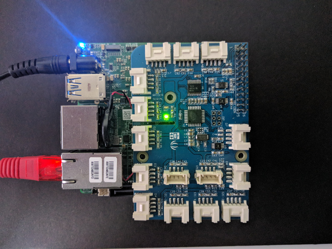
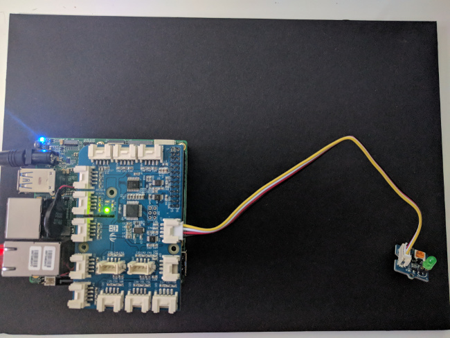
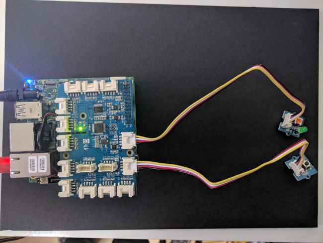
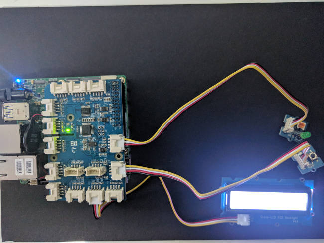
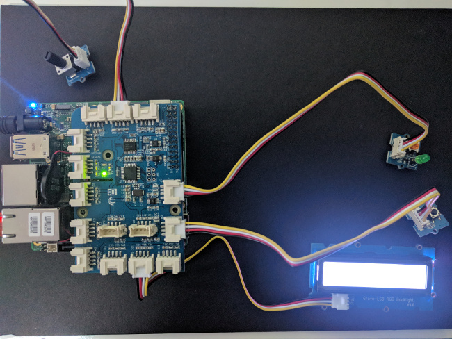
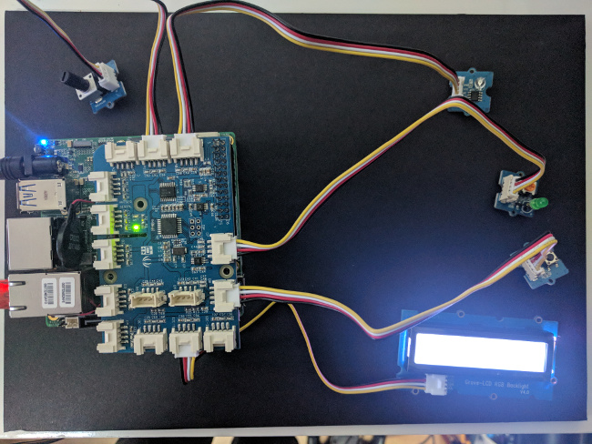

# UP2 Sensor Station

## What you need

    - UP2 board running latest Ubuntu OS
    - Grove IoT Starter Kit parts
    - Personal computer with Go 1.10+ installed

## Installation

```
go get -d -u gobot.io/x/gobot/...
```

The Gobot driver for the GrovePi+ board requires that the board has been upgraded to firmware v1.3.0+ which has already been done for you if you are at the Gophercon hackday.

## Running the code

When you run any of these examples, you will compile the code on your computer, but then execute the binary file on the UP2 board itself.

This will require moving the compiled code onto the UP2 board, and then execute the code on the UP2 board itself, not on your own computer.

We have included a shell script to make this process easier. On Linux or macOS, you can run it like this (assuming the IP of the UP2 is `192.168.1.42`):

```
./runner.sh step1 192.168.1.42
```

On Windows, you can run it like this:

```
runner.cmd step1 192.168.1.42
```

Note: You'll use the IP Address you get during the setup process

The `runner.sh` script performs the following steps for you:

For example, to compile the code for step 1:

```
GOARCH=amd64 GOOS=linux go build -o step1app step1/main.go
```

Then to move the code to the UP2 board, it uses the `scp` command:

```
scp step1app upsquared@[IP of your device]:/home/upsquared/step1app
```

Lastly, to execute it on your UP2 board, it uses the `ssh` command:

```
ssh -t upsquared@[IP of your device] ./step1app
```

Ready? Let's get started.

### step0 - Connect the GrovePi Shield

Connect the shield to the end of the pins on the UP2 board as shown below.



### step1.go - LED



Connect the green LED to pin D7 on the GrovePi+ board using the Grove connector.

Run the code:

```
$ ./runner.sh step1 [IP of your device]
```

You should see the LED blink.

### step2.go - LED, Button



Connect the Grove button to pin D8 on the GrovePi+ board using the Grove connector.

Run the code:

```
$ ./runner.sh step2 [IP of your device]
```

When you press the button, you should see the LED turn on. When you release the button, it should turn off.

### step3.go - LED, Button, RGB LCD Display



Connect the Grove RGB LCD to pin i2c-1 on the GrovePi+ board using the Grove connector.

Run the code:

```
$ ./runner.sh step3 [IP of your device]
```

Now when you press the button, in addition to the LED turning on, you should also RGB LCD display a message that the button has been pushed. When you release the button, the LED should turn off, and a different message displayed on the RGB LCD.

### step4.go - LED, Button, RGB LCD Display, Rotary



Connect the Grove Rotary dial to pin A1 on the GrovePi+ board using the Grove connector.

Run the code:

```
$ ./runner.sh step4 [IP of your device]
```

Now when you press the button, in addition to the LED turning on, you should also RGB LCD display a message that the button has been pushed. When you release the button, the LED should turn off, and a different message displayed on the RGB LCD.

### step5.go - LED, Button, RGB LCD Display, Rotary, Gobot API


In this step, you will try out the Gobot API. No additional hardware is added.

You'll need to tunnel to the device. Here is an example

```
ssh -L 3000:localhost:3000 pi@<YOUR DEVICE IP>
```

Open `localhost:3000` to view the built in device browser.
We also added a custom handler to `device/rotary` to create a IoT example. You can use curl to call the endpoint

```
curl localhost:3000/devices/rotary
```

Run the code:

```
$ ./runner.sh step5 [IP of your device]
```

### step6.go - LED, Button, RGB LCD Display, Rotary, Gobot API, Light Sensor



Connect the Grove Light sensor to pin A2 on the GrovePi+ board using the Grove connector.

Run the code:

```
$ ./runner.sh step6 [IP of your device]
```

When the light level changes, you should see a message on the RGB LCD display.
